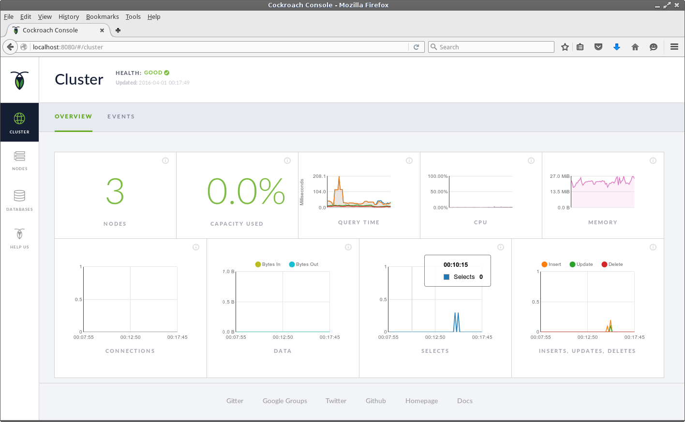

## Connect to the Database

The `cockroach` executable contains a built-in client that enables you to connect to a cockroachDB cluster and execute SQL statements.

1. On the virtual machine, using a terminal, as the `osboxes` user, logon to the cluster using the `cockroach sql --url postgresql://root@localhost:26257?sslmode=disable` command.

   For example, the  `SHOW DATABASES` command shows all the databases in the cluster.

   ```Shell
   osboxes@osboxes:~$ cockroach sql --url postgresql://root@localhost:26257?sslmode=disable
   # Welcome to the cockroach SQL interface.
   # All statements must be terminated by a semicolon.
   # To exit: CTRL + D.
   root@localhost:26257> show databases;
   +----------+
   | Database |
   +----------+
   | system   |
   +----------+
   root@localhost:26257> ^D
   osboxes@osboxes:~$ 
   ```
   
   You can also use the individual parameters like `cockroach sql --insecure --host localhost --port 26257 --user root`. See `cockroach sql --help` for more info.

## Start the Admin GUI

When you start each database instance, it displays the URL of the Admin UI you can connect to to monitor the cluster. 

1. On the virtual machine, open the FireFox web browser and go to `http://localhost:8080` which is the admin interface of the first cluster node.

   For more information on how to use the Admin UI and what it contains, refer to the [Explore the Admin UI](https://www.cockroachlabs.com/docs/explore-the-admin-ui.html) in the CockroachDB documentation.

   


You can also inspect the cluster status from the command line by executing the `cockroach node status` command.

```Shell
osboxes@osboxes:~$ cockroach node status
+----+-----------------+---------------+---------------------+---------------------+------------+-----------+-------------+--------------+--------------+---------------+-------------+--------------+
| id |     address     |     build     |     updated_at      |     started_at      | live_bytes | key_bytes | value_bytes | intent_bytes | system_bytes | leader_ranges | repl_ranges | avail_ranges |
+----+-----------------+---------------+---------------------+---------------------+------------+-----------+-------------+--------------+--------------+---------------+-------------+--------------+
|  1 | localhost:26257 | beta-20160330 | 2016-04-01 01:37:49 | 2016-03-31 23:56:09 |   14337073 |      4703 |    14333200 |            0 |         3388 |             5 |           5 |            5 |
|  2 | localhost:26258 | beta-20160330 | 2016-04-01 01:37:44 | 2016-03-31 23:58:24 |   14329135 |      4703 |    14325262 |            0 |         3388 |             0 |           0 |            0 |
|  3 | localhost:26259 | beta-20160330 | 2016-04-01 01:37:48 | 2016-03-31 23:59:28 |   14329135 |      4703 |    14325262 |            0 |         3388 |             0 |           0 |            0 |
+----+-----------------+---------------+---------------------+---------------------+------------+-----------+-------------+--------------+--------------+---------------+-------------+--------------+
osboxes@osboxes:~$ 
```

## What's Next

That's the end of the Quick Start Guide. You should have a 3 node CockroachDB up and running with which you can explore and experiment with the features and functionality of the database. Enjoy!

Try a few SQL commands like:

```Shell
root@:26257> CREATE DATABASE bank;
CREATE DATABASE

root@:26257> SET DATABASE = bank;
SET

root@:26257> CREATE TABLE accounts (id INT PRIMARY KEY, balance DECIMAL);
CREATE TABLE

root@26257> INSERT INTO accounts VALUES (1234, DECIMAL '10000.50');
INSERT 1

root@26257> SELECT * FROM accounts;
+------+----------+
|  id  | balance  |
+------+----------+
| 1234 | 10000.50 |
+------+----------+
```

or [Learn CockroachDB SQL](https://www.cockroachlabs.com/docs/learn-cockroachdb-sql.html).

When you have finished you can either shut the [Database](/cockroach-vb-single/cockroach-vb-single_db_shutdown) and [Machine](cockroach-vb-single_vm_shutdown) down for next time or [Uninstall](cockroach-vb-single_uninstall) them completely.
