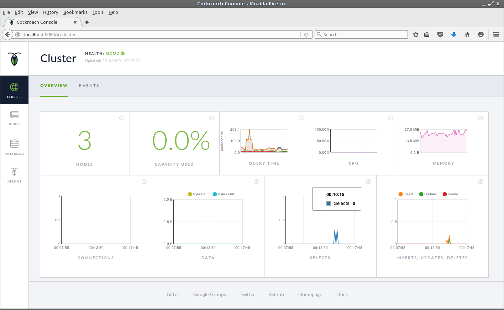

## Start the Admin GUI

When you start each database instance, it displays the URL of the Admin UI you can connect to to monitor the cluster. 

On the virtual machine, open the FireFox web browser and go to `http://localhost:8080` which is the admin interface of the first cluster node.

For more information on how to use the Admin UI and what it contains, refer to the [Explore the Admin UI](https://www.cockroachlabs.com/docs/explore-the-admin-ui.html) in the CockroachDB documentation.




You can also inspect the cluster status from the command line by executing the `cockroach node status` command.

```Shell
osboxes@osboxes:~$ cockroach node status
+----+-----------------+---------------+---------------------+---------------------+------------+-----------+-------------+--------------+--------------+---------------+-------------+--------------+
| id |     address     |     build     |     updated_at      |     started_at      | live_bytes | key_bytes | value_bytes | intent_bytes | system_bytes | leader_ranges | repl_ranges | avail_ranges |
+----+-----------------+---------------+---------------------+---------------------+------------+-----------+-------------+--------------+--------------+---------------+-------------+--------------+
|  1 | localhost:26257 | beta-20160330 | 2016-04-01 01:37:49 | 2016-03-31 23:56:09 |   14337073 |      4703 |    14333200 |            0 |         3388 |             5 |           5 |            5 |
|  2 | localhost:26258 | beta-20160330 | 2016-04-01 01:37:44 | 2016-03-31 23:58:24 |   14329135 |      4703 |    14325262 |            0 |         3388 |             0 |           0 |            0 |
|  3 | localhost:26259 | beta-20160330 | 2016-04-01 01:37:48 | 2016-03-31 23:59:28 |   14329135 |      4703 |    14325262 |            0 |         3388 |             0 |           0 |            0 |
+----+-----------------+---------------+---------------------+---------------------+------------+-----------+-------------+--------------+--------------+---------------+-------------+--------------+
osboxes@osboxes:~$ 
```

## What's Next

Try a few SQL commands like:

```Shell
root@:26257> CREATE DATABASE bank;
CREATE DATABASE

root@:26257> SET DATABASE = bank;
SET

root@:26257> CREATE TABLE accounts (id INT PRIMARY KEY, balance DECIMAL);
CREATE TABLE

root@26257> INSERT INTO accounts VALUES (1234, DECIMAL '10000.50');
INSERT 1

root@26257> SELECT * FROM accounts;
+------+----------+
|  id  | balance  |
+------+----------+
| 1234 | 10000.50 |
+------+----------+
```

or [Learn CockroachDB SQL](https://www.cockroachlabs.com/docs/learn-cockroachdb-sql.html).

When you have finished you can either shut the [Database](/cockroach-vb-single/cockroach-vb-single_db_shutdown) and [Machine](cockroach-vb-single_vm_shutdown) down for next time or [Uninstall](cockroach-vb-single_uninstall) them completely.
