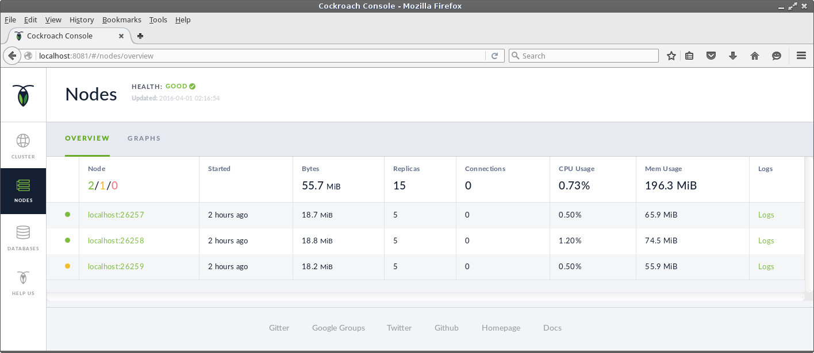

## Database Node Shutdown

The `cockroach quit` command can be used to shutdown a database node. When all current requests have finished, the node will shutdown. Because all instances are running on the same machine, we need to specify the server port to connect to.


For example, shutting down the third instance.

```Shell
osboxes@osboxes:~$ cockroach quit --http-port 8082
node drained and shutdown: ok

osboxes@osboxes:~$ initiating graceful shutdown of server
server drained and shutdown completed

[3]+  Done                    cockroach start --store=cockroach-data3 --port=26259 --http-port=8082 --join=localhost:26257
osboxes@osboxes:~$ 
```

The Admin UI will still show 3 nodes in the cluster as we have just shut one down, we haven't removed it. The NODES page of the Admin UI will show the node's status.



If you want to completely remove a node from the cluster, use the `cockroach exterminate` command. This will shut down the node, destroy all data held by the node, and remove the node from the cluster.

{{site.data.alerts.warning}}
The Admin UI is served from the same cockroach executable that runs the database node. If you shutdown the database node that your Admin UI is connected to, it will stop working. You will need to reconnect to another operational node.
{{site.data.alerts.end}}


## Virtual Machine Shutdown

The CockroachDB virtual machine can be administered from the Oracle VM VirtualBox Manager GUI but the easiest way is to execute the `sudo shutdown -h now` command from a terminal.

The cockroachDB instances are not automatically shutdown when you shutdown the virtual machine so make sure they are shut down first.


