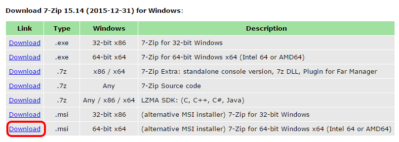
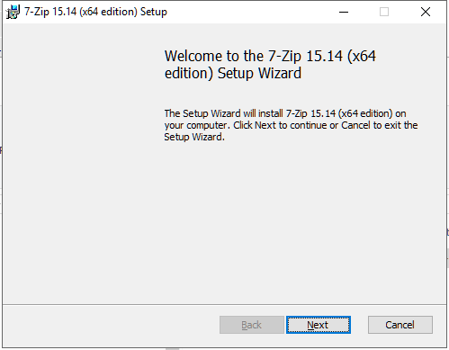
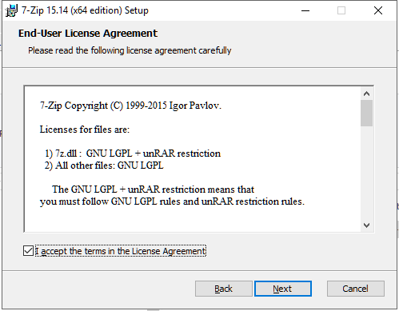
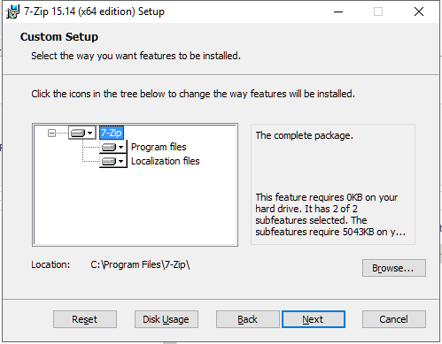
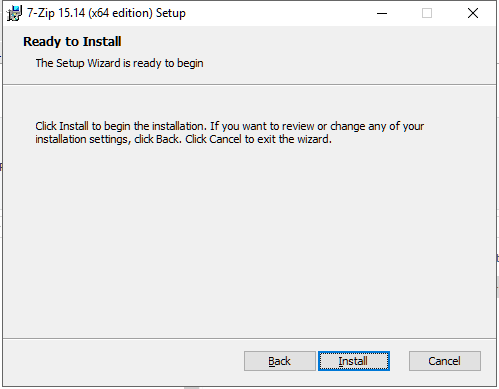
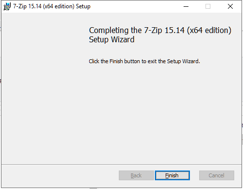

## Download 7zip

From your host machine, download the **7zip msi installer** file from the [7zip download page](http://www.7-zip.org/download.html).

Select either the 32 or 64 bit versions depending on your host operating system.

## Install 7zip

Install 7zip into the default location, accepting all the defaults during the installation.

Double-click the .msi file to start the installation, click `Next` on the Welcome screen.

Accept the License Agreement and click `Next`.

Accept the default location and features and click `Next`.

click `Next` to start the installation.

Click `Finish` to exit the Setup Wizard.

7zip has a graphical user interface (GUI) which is the most common way to use 7zip. It also comes with a command line version called **7z** which is the one the Create_VM script uses to uncompress the disk image.

## What's Next

The [VirtualBox](/cockroach-vb-single/cockroach-vb-single_host_virtualbox) section shows you how to install this software.

