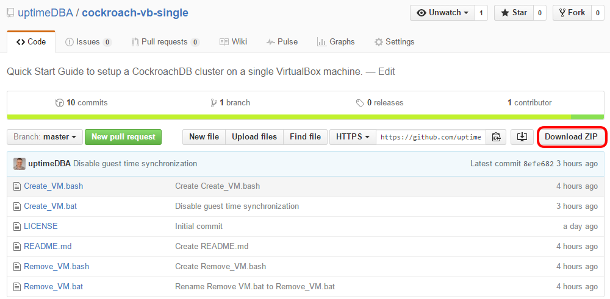

## Hardware Requirements

### Operating System

You will need a version of Windows, Mac OS X, or Linux that runs [VirtualBox](https://www.virtualbox.org). If you are installing on a Windows host, you will also need [7zip](http://www.7-zip.org/) to uncompress the downloaded files that are part of this guide.
VirtualBox is supported by various versions of Windows, Linux, and Mac OS X. Please check the version compatibility of these products against your version of your host operating system.

The virtual machine in this guide was constructed on a 64bit Windows 10 Professional host machine with an Intel i7-4770 CPU and 32Gb of memory. Other vesions of Windows and Mac OS X have not been tested yet.

### Memory

The required minimum host machine memory is **3Gb** with the recommended being **6Gb** or greater.

### Disk

The virtual machine as a single **100Gb**, dynamically allocated VDI type disk. Because the disk is dynamically allocated, the actual disk size of the installed machine is around **4Gb** when started. The amount of data loaded into the database nodes will determine the final disk space used, up to 100Gb.

The suggested minimum host machine disk space requirement is **6Gb**. The theoretical maximum host machine disk space requirement is approximately **110Gb**.

{{site.data.alerts.important}}
The VirtualBox machines that get created will reside in the VirtualBox Default Machine Folder. By default this is called "VirtualBox VMs" and on Windows is set to %HOMEDRIVE%%HOMEPATH% which is usually C:\Users\username\. On Mac OS X, it's /Users/username, and on Linux it's /home/username. 
This is where most of the disk space will be consumed. If you want to change the location of the virtual machine, you can change the Default Machine Folder under File-->Perferences-->General in VirtualBox and the value of the MACHINE_FOLDER variable in the Create_VM script.
{{site.data.alerts.end}}

## Software Requirements

The following software components are required on the host machine. The versions listed are the versions used in this guide.
Versions greater than those listed should also work.

|--
| Software | Version
|:-|:-
| VirtualBox | 5.0.14
| 7zip\* | 15.14
|---

\*If you are using a Linux or Mac host, you don't need 7zip.

The following pages will instruct you how to install and setup this software.

## Download the Configuration Files

A few small configuration files have been created to save you some typing. They can be downloaded in a zip file which when unzipped will create a directory with the files.

Download the files from the guide's github repository. You don't have to have a github account, just go to the [repository](https://github.com/uptimeDBA/cockroach-vb-single) at `https://github.com/uptimeDBA/cockroach-vb-single` and click on the `Download ZIP` button as shown below.

The zip file will be called `cockroach-vb-single-master.zip`. Save the file into the directory where you want to create the `cockroach-vb-single` directory.
Unzip the file into the this directory. It will create a directory called `cockroach-vb-single-master` with the required files. 

Rename the `cockroach-vb-single-master` directory to `cockroach-vb-single`.

{{site.data.alerts.tip}}
The directory name cockroach-vb-single-master is a bit long so I've removed the "-master" and renamed it to "cockraoch-vb-single". That's the name that is refered to throughout the guide so I suggest you rename your directory as well.
{{site.data.alerts.end}}

This guide uses `C:\cockroach-vb-single` but any name is ok.

There's a couple of files used by Github that are also included in the zip file, files like `LICENSE.md` and `README.md`. They can be deleted or ignored.

## What's Next

The [7zip](/cockroach-vb-single/cockroach-vb-single_host_7zip) section shows you how to install this software utility.