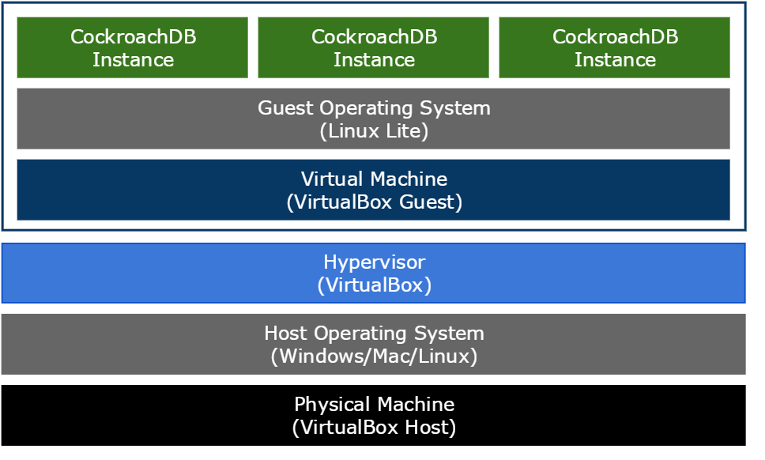

The logical architecture built using this guide looks like this. The diagram shows the 3 CockroachDB database instances running inside a single VirtualBox machine on a host machine.

{{site.data.alerts.important}}
This is not a configuration you would use for anything other than getting a minimal cluster up and running quickly.
{{site.data.alerts.end}}

## Install VirtualBox

1.  Download and install the latest version of [VirtualBox](https://www.virtualbox.org/manual/ch06.html) onto your host machine. Accept all the default choices during install. This guide was created and tested using version 5.0.14 but should work with newer versions.

2.  The VirtualBox Extension Pack that is optionally installed on the host machine is not required for this guide but you can install it if you want to. The VirtualBox Guest Additions that are optionally install on the guest machines are also not required.

## Configure VirtualBox

### Default Machine Folder

VirtualBox doesn't require much configuration for the setup in this guide. You may want to change the default location where VirtualBox creates virtual machines on your host machine.

## VM Network

The network interface configured on the virtual machine is of type NAT (Network Address Translation). It allows the machine to use the host machine's networking to access the Internet and requires no additional configuration on the host. See the [Introduction to networking modes](https://www.virtualbox.org/manual/ch06.html#networkingmodes) in the VirtualBox Documentation for more information.

While the guest machine can access the Internet using NAT via the host's network, outside machines **including the host** cannot access the guest directly. Access to the guest is done using a terminal on the GUI console when the machine is started.

## What's Next

The [Virtual Machine](cockroach-vb-single_vm_overview) chapter shows you how to configure and create the virtual machine.
