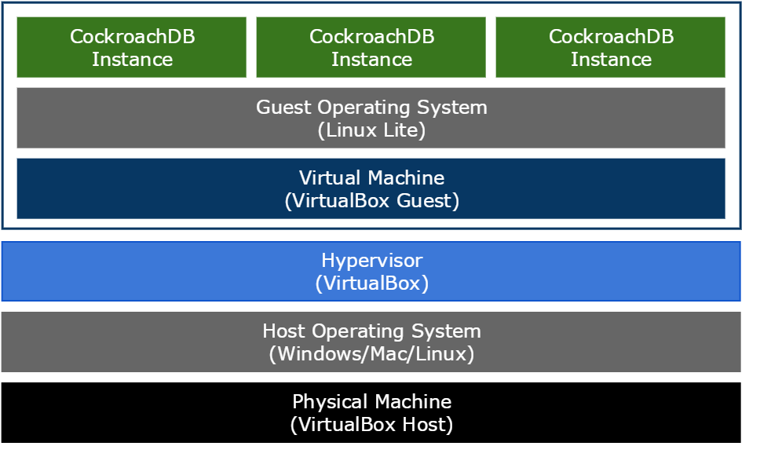

## Logical Architecture

For a high-level overview of what you will be building with this guide, the logical architecture of the cluster looks like this:

All 3 CockroachDB instances will be started from a single virtual machine. This configuration is something that you wouldn't use for real implementations but it allows you to get a minimal CockroachDB cluster up and running quickly.

VirtualBox will work on Mac OS/X and Linux so you could use one of those for the host machine instead of Windows. Instructions for a Mac or Linux host are coming soon but it's reasonably easy to work out what to do.

If you haven't used VirtualBox before, I would recommend you read [Chapter 1. First
Steps](https://www.virtualbox.org/manual/ch01.html) in the VirtualBox manual as a brief introduction.

## Task Flow

The basic approach is to download a pre-built VirtualBox disk image to save time having to install an operating system into a VirtualBox machine. Then we download and install the latest CockroachDB software and start a 3 node cluster on the single VirtualBox machine.

This quick start guide uses [Linux Lite](https://www.linuxliteos.com/) in a pre-built VirtualBox image from [osboxes.org](http://www.osboxes.org/) as a starting point. There's nothing special about Linux Lite, it's just a small Linux distribution that contains everything required and has a pre-built VirtualBox image available.

## What's Next

The [Host Machine](cockroach-vb-single_host_overview) overview will tell you what you need on your host machine.

