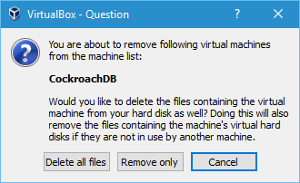

## Remove the Virtual Machine

1. Shutdown the machine, then in the Oracle VM VirtualBox Manager GUI, highight the machine, and select `Machine ==> Remove...` from the menu.

   

Click the `Delete all files` button to remove the machine and all associated files created by VirtualBox.

## Remove VirtualBox

1. To remove VirtualBox, click the "Windows" icon to open the Start screen. Find the VirtualBox icon and right-click and select "Uninstall".

## Remove the Uncompress Utility

1. To remove 7zip, click the "Windows" icon to open the Start screen. Find the 7zip icon and right-click and select "Uninstall".

## Remove the cockroach-vb-single directory.

1. Delete the `cockroach-vb-single` directory and all its contents.
