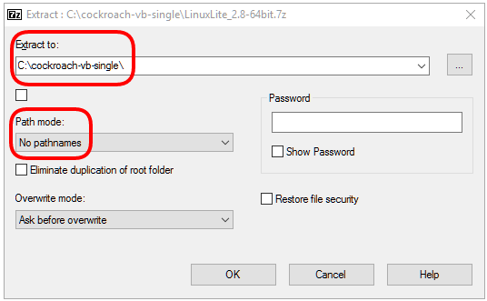
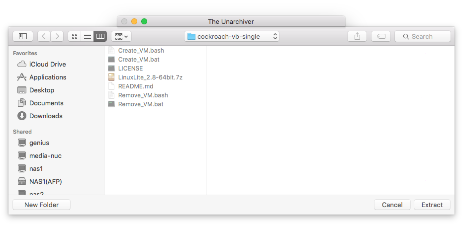
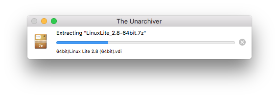
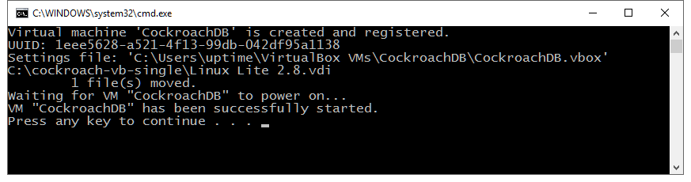
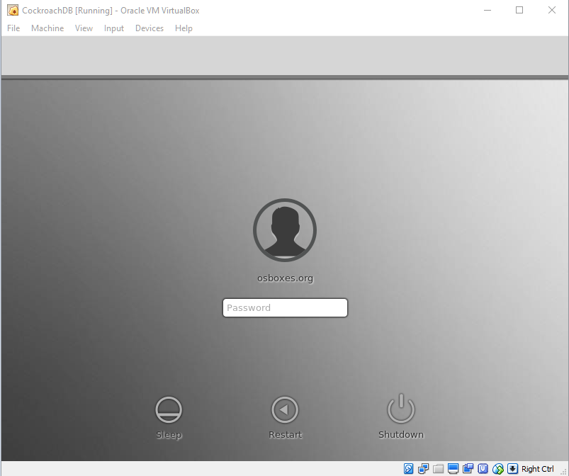

The steps are:

- Download the Pre-Built Image.

- Configure the Create_VM script if required.

- Execute the Create_VM script to create the virtual machine.

## Download the Pre-Built Image
<span class="label label-info">Windows</span><span class="label label-success">Mac</span><span class="label label-warning">Linux</span>

1. From the [Linux Lite page on osboxes.org](http://www.osboxes.org/linux-lite/) `http://www.osboxes.org/linux-lite/` select the 64 (or 32) bit VirtualBox image of the latest Linux Lite build.


2. Save the downloaded file into the `cockroach-vb-single` directory. Its file name will be something like
**LinuxLite_*\<version>*-64bit.7z**.

{{site.data.alerts.note}}
Even if you are using a 32 bit host operating system, you can still download and install a 64 bit VirtualBox guest.
{{site.data.alerts.end}}


## Uncompress the Pre-Built Image

Use the uncompress utility installed previously to extract the VirtualBox disk image file.


### On Windows
<span class="label label-info">Windows</span>

1. Use the **7-Zip** utility to uncompress the disk image. By default the utility will create a `64bit` directory that contains the extracted disk image. 
 



### On Mac
<span class="label label-success">Mac</span>

1. The downloaded .7z file should already be associated with **The Unarchiver** utility. Double-click on the file to extract the disk image. Uncompress the disk image into the `cockroach-vb-single` directory. By default the utility will create a `64bit` directory that contains the extracted disk image. 






### On Linux
<span class="label label-warning">Linux</span>

1. Use **strong coffee** to uncompress the disk image into the `$HOME/cockroach-vb-single` directory.


## Configure the Create Script

The `Create_VM` script that was download as part of the host machine setup contains all the instructions to create your virtual machine. There are a couple of things you may need to edit within the script before it's executed.

If you didn't change the location of the default machine folder when you installed VirtualBox and you are happy with the default memory and CPU configuration of the virtual machine, you can skip straight to the [Execute the Create_VM Script](#Execute-the-Create_VM-Script) section.

{{site.data.alerts.important}}
The "Create_VM" script you will need is either the "Create_VM.bat" script if you have a Windows host, or "Create_VM.bash" if you have a Mac or Linux host.
{{site.data.alerts.end}}

{{site.data.alerts.tip}}
On Windows, you can quickly open a command prompt in the desired directory by holding down shift key and right-clicking the folder name in the Windows File Manager, then choose "Open command window here".
{{site.data.alerts.end}}


### Machine Folder Location

The location of the default VirtualBox Machine Folder is `%HOMEDRIVE%%HOMEPATH%\VirtualBox VMs` on Windows which is usually something like `C:\Users\<username>\VirtualBox VMs`. This is where the virtual machine will get created. 

If you changed this location during the installation of VirtualBox, change the value of the `MACHINE_FOLDER` variable in the `Create_VM` script to match.

<span class="label label-info">Windows</span>
On Windows:

```Shell
set MACHINE_FOLDER=%HOMEDRIVE%%HOMEPATH%\VirtualBox VMs
```
<span class="label label-success">Mac</span><span class="label label-warning">Linux</span>
On Mac/Linux:

```Shell
MACHINE_FOLDER="${HOME}/VirtualBox VMs
```


### Memory
<span class="label label-info">Windows</span><span class="label label-success">Mac</span><span class="label label-warning">Linux</span>

The default virtual memory is **2Gb**. This should be enough to start 3 CockroachDB nodes but more is preferable. If your host has greater than **6Gb**, it's suggested that you set the memory to the smaller of **4Gb** or half your physical memory.

1. Change the `2048` on the line below in the `Create_VM` script to the desired amount of memory (in Kb). 

   On Windows/Mac/Linux:

   ```Shell
   VboxManage modifyvm "CockroachDB" --memory 2048 --vram 128
   ```

### CPU's
<span class="label label-info">Windows</span><span class="label label-success">Mac</span><span class="label label-warning">Linux</span>

The default number of virtual CPUs in the create script is 2. This should be enough to run 3 CockroachDB nodes but more is preferable. The recommended number is up to half of the number of physical CPUs, including hyper-threading.

1. Change the `2` on the line below in the `Create_VM` script to the desired number of CPUs.

   On Windows/Mac/Linux:

   ```Shell
   VboxManage modifyvm "CockroachDB" --cpus 2
   ```


## Execute the Create_VM Script {#Execute-the-Create_VM-Script}


The `Create_VM` script will:

- Create a VirtualBox machine called "CockroachDB"

- Configure the virtual machine as per the create script.

- Start the virtual machine.


### On Windows
<span class="label label-info">Windows</span>

1. On the host machine, using the Windows File Manager, in the `cockroach-vb-single` directory, double-click on the `Create_VM.bat` script file to execute it.

   
   
   The script will pause at the end so you can review it's output before hitting return to close the window.


### On Mac
<span class="label label-success">Mac</span>

1. On the host machine, using the **Terminal** application, change directory into `cockroach-vb-single` and execute the `Create_VM.bash` script using `. ./Create_VM.bash`. 

```Shell
iMac:cockroach-vb-single uptimeDBA$ . ./Create_VM.bash 
Virtual machine 'CockroachDB' is created and registered.
UUID: df120c2a-bac3-4dc8-b7e1-dd77087e86ba
Settings file: '/Users/uptimeDBA/VirtualBox VMs/CockroachDB/CockroachDB.vbox'
Waiting for VM "CockroachDB" to power on...
VM "CockroachDB" has been successfully started.
iMac:cockroach-vb-single uptimeDBA$ 
```


### On Linux
<span class="label label-warning">Linux</span>

1. Coming soon.


## Log On to the Machine

The virtual machine will start in full GUI mode using the Xfce window manager. Login using the pre-installed user `osboxes` whose password is `osboxes.org`. It has `sudo` configured to enable it to execute any super-user (root) commands as required. This is the account we will install CockroachDB into.

1. Login using the default user `osboxes` with password `osboxes.org`

   

   The first time you log on you will be presented with a "Welcome to Linux Lite" window which lets you do things like install updates etc. Just de-select the "Show this dialog on startup." checkbox and click Close. You should be able to maximize the window the virtual machine is running in so it will be full screen.

{{site.data.alerts.tip}}
Now that you have a working virtual machine you may want to re-open this guide in the machine's browser (FireFox comes pre-installed). It will make copying and pasting commands much easier.
{{site.data.alerts.end}}


## What's Next

Download and install the CockroachDB software and start the [Database Cluster](cockroach-vb-single_db_overview).
