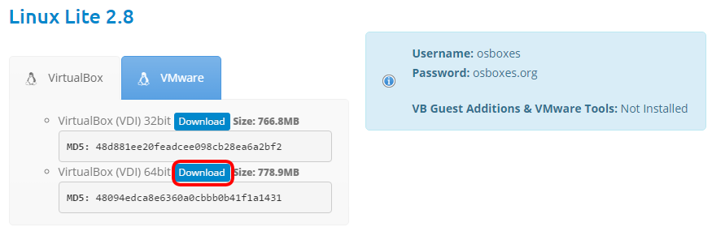

## Download the Pre-Built Image


From the [Linux Lite page on osboxes.org](http://www.osboxes.org/linux-lite/) `http://www.osboxes.org/linux-lite/` select the 64 (or 32) bit VirtualBox image of the latest Linux Lite build.



Save the downloaded file in the `C:\cockroach-vb-single` directory. Its file name will be something like
**LinuxLite_*\<version>*-64bit.7z**.


{{site.data.alerts.note}}
You don't have to uncompress this disk image. The Create_VM script will uncompress, move and rename the disk file for you.
{{site.data.alerts.end}}

The `Create_VM` script that was download as part of the host machine setup contains all the instructions to create your virtual machine. There are a couple of things you may need to edit within the script before it's executed.

The `Create_VM` script you will need is either the `Create_VM.bat` script if you have a Windows host, or `Create_VM.bash` (Coming soon) if you have a Mac or Linux host.


## Configure the Create Script

{{site.data.alerts.tip}}
You can quickly open a command prompt in the desired directory by holding down shift key and right-clicking the folder name in the Windows File Manager, then choose "Open command window here".
{{site.data.alerts.end}}


### Machine Folder Location

The location of the default VirtualBox Machine Folder is `%HOMEDRIVE%%HOMEPATH%\VirtualBox VMs` on Windows which is usually something like `C:\Users\<username>\VirtualBox VMs`. This is where the virtual machine will get created. 

If you changed this location during the installation of VirtualBox, change the value of the `MACHINE_FOLDER` variable in the `Create_VM` script to match.

```Shell
set MACHINE_FOLDER=%HOMEDRIVE%%HOMEPATH%\VirtualBox VMs
```


### Memory

The default virtual memory is **2Gb**. This should be enough to start 3 CockroachDB nodes but more is preferable. If your host has greater than **6Gb**, it's suggested that you set the memory to the smaller of **4Gb** or half your physical memory.

Change the `2048` on the line below in the `Create_VM` script to the desired amount of memory (in Kb). 

```Shell
VboxManage modifyvm "CockroachDB" --memory 2048 --vram 128
```

### CPU's

The default number of virtual CPUs in the create script is 2. This should be enough to run 3 CockroachDB nodes but more is preferable. The recommended number is up to half of the number of physical CPUs, including hyper-threading.

Change the `2` on the line below in the `Create_VM` script to the desired number of CPUs.

```Shell
VboxManage modifyvm "CockroachDB" --cpus 2
```


## Execute the Create Script

On the host machine, using the Windows File Manager, in the `C:\cockroach-vb-single` directory, double-click on the `Create_VM` script file to execute it. The script will:

- Create a VirtualBox machine called "CockroachDB"

- Uncompress the pre-built disk image into the VirtualBox machine folder.

- Configure the virtual machine as per the create script.

- Start the virtual machine.

The script will pause at the end so you can review it's output before hitting return to close the window.

```Shell
Virtual machine 'CockroachDB' is created and registered.
UUID: b36fa91f-d409-46ea-9da6-cceedcd9fa07
Settings file: 'F:\VirtualBox VMs\CockroachDB\CockroachDB.vbox'

7-Zip [64] 15.14 : Copyright (c) 1999-2015 Igor Pavlov : 2015-12-31

Scanning the drive for archives:
1 file, 778880932 bytes (743 MiB)

Extracting archive: LinuxLite_2.8-64bit.7z
--
Path = LinuxLite_2.8-64bit.7z
Type = 7z
Physical Size = 778880932
Headers Size = 195
Method = LZMA2:25
Solid = -
Blocks = 1

Everything is Ok

Folders: 1
Files: 1
Size:       3704619008
Compressed: 778880932
Waiting for VM "CockroachDB" to power on...
VM "CockroachDB" has been successfully started.
Press any key to continue . . .
```


## Log On to the Machine

The virtual machine will start in full GUI mode using the Xfce window manager. Login using the pre-installed user `osboxes` whose password is `osboxes.org`. It has `sudo` configured to enable it to execute any super-user (root) commands as required. This is the account we will install CockroachDB into.

The first time you log on you will be presented with a "Welcome to Linux Lite" window which lets you do things like install updates etc. Just de-select the "Show this dialog on startup." checkbox and click Close. You should be able to maximize the window the virtual machine is running in so it will be full screen.

{{site.data.alerts.tip}}
Now that you have a working virtual machine you may want to re-open this guide in the machine's browser (FireFox comes pre-installed). It will make copying and pasting commands much easier.
{{site.data.alerts.end}}


## What's Next

Download and install the CockroachDB software and start the [Database Cluster](cockroach-vb-single_db_overview).
